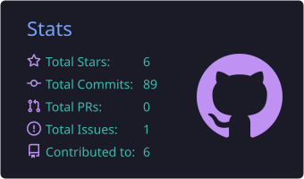
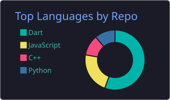
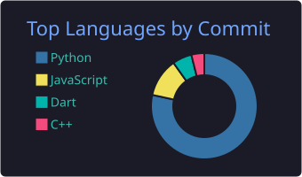
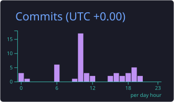

# Hi, I'm Abdelrahman Essam 👋

**Full Stack Software Engineer** specializing in **Flutter**, **Django / Laravel**, **React / Next.js**, and production-ready system architecture.

I build high-performance mobile & web apps, lead development teams, and ship scalable backends used in real products — from e-commerce and logistics to AI-assisted platforms.

🚀 **Currently:** Full Stack Software Engineer / Head of Developers at **[Gift of the Givers](https://giftofthegivers.org/)**, leading donation, logistics, and volunteer platforms across multiple countries.

📁 **Portfolio:** [portfolio-omega-one-ao8j6gmdc9.vercel.app](https://portfolio-omega-one-ao8j6gmdc9.vercel.app/)

---

## 🌐 Socials

---

## 💻 Tech Stack

**Languages**  

**Frameworks & Libraries**  

**Databases**  

**DevOps & Tooling**  

**Architecture**  
`Clean Architecture` · `Monorepo (Turborepo)` · `MVVM / MVI / MVC` · `REST & tRPC APIs` · `Payment Gateways` · `Multi-role Admin Systems`

---

## 📌 Featured Projects

### 🛍 [Koshtna](https://koshtna.cloud/) — Multi-branch Bakery E-commerce
`Flutter` `Laravel` `Filament` `PostgreSQL` `Redis` `Plutu` `Docker`
- Full commerce stack: mobile apps, Filament admin, per-branch inventory, delivery tracking, multi-role access, Arabic-first localization, and online payments.
- Live: [Store](https://koshtna.cloud/) · [Admin](https://admin.koshtna.cloud/) · [Demo](https://drive.google.com/drive/folders/1MdhLwZKuciOyTpQnt9CrDdKOt5a64B_M?usp=sharing)

### 📦 MOFS / Gift of the Givers — Operations Platform
`Flutter` `Django` `Flask` `PostgreSQL` `Docker`
- Donation, logistics, and volunteer management across multiple countries; multi-role operational workflows.
- [giftofthegivers.org](https://giftofthegivers.org/) · [Web app](https://gog-web-13346-237ea.web.app/#/MainScreen)

### 🏠 [Stayr](https://stayr.vercel.app) — Group Vacation Planning (Expo)
`Expo` `React Native` `TypeScript` `Hono` `Drizzle` `PostgreSQL` `Supabase`
- Swipe stays, build a shared shortlist, compare options, then book via partner platforms.

### 🔧 Katina — Auto Parts Marketplace
`Flutter` `Bloc` `Clean Architecture` `Maps`
- Part requests, shop bidding, inventory, payments/commissions, and bilingual Arabic/English UX.

### 🏡 Beyot Sudan — Real Estate Marketplace
`Django` `DRF` `Flutter` `PostgreSQL` `Redis` `Firebase`
- Sale/rent listings with admin approval, WhatsApp OTP auth, FCM notifications, and search/filters.
- [Admin](https://admin.bayutsd.com/login)

### ⚽ Champions Challenge — Football Trivia *(10K+ downloads)*
`Flutter` `Firebase` `PostgreSQL`
- 8 minigames with high fan engagement.  
- [Demo](https://drive.google.com/drive/folders/1nMlgrhIXTZTTTy82klSm_Xf3Cqu2EZwH?usp=sharing)

### 🏆 Troviny — Trip Planner *(#2 Graduation Project)*
`Flutter` `Django` `PostgreSQL` `Firebase` `Railway` `SendGrid`
- Trip planning, recommendations, and community features.  
- [Demo](https://drive.google.com/drive/folders/1OxEwmeXsUpIcpUMCVPk2B8GJReEFD4wW?usp=sharing)

### 🚨 Crime Catcher — Community Safety App
`Flutter` `Django` `PostgreSQL` `Firebase` `Maps`
- Crime reporting, danger-map pins, authority alerts, and SOS live-location sharing.  
- [Demo](https://drive.google.com/drive/folders/1h4iP9od2UGkLgOGXzyPbcQcZY4bg2PTo?usp=sharing) · [Repo](https://github.com/Abdelrahmanessam1254/crime_app)

### 🏥 [Patient Referral Intake](https://github.com/Abdelrahmanessam1254/clinic-referral)
`Next.js` `tRPC` `Drizzle` `PostgreSQL` `Zod` `Turborepo` `Vitest` `Docker`
- Type-safe clinical referral intake monorepo with shared Zod schemas end to end.

### 🧠 [Clinical QA Engine](https://github.com/Abdelrahmanessam1254/Clinical-QA-Engine)
`Python` `FastAPI` `OpenAI` `Gemini` `Grok`
- LLM API that scores clinical notes and returns severity-tagged actionable feedback.

### 🚆 [Lagovia Train Tracker](https://github.com/Abdelrahmanessam1254/Lagovia-Train-Tracker)
`TypeScript` `React` `iRail API`
- Belgian rail delay/cancellation lookup (Digital Product School challenge).

### 💬 [WhatsApp Clone](https://github.com/Abdelrahmanessam1254/WhatsApp_Clone)
`Flutter` `Provider` `intl`
- Chats, Status, Calls, dark/light mode, and search.

---

## 📊 GitHub Stats

<!-- SVGs are stored in this repo (./assets) so GitHub Camo won't break external hosts -->

  
  

  
  

  
  

  

---

## 🔗 Highlighted Public Repos

| Repo | Description |
|------|-------------|
| [clinic-referral](https://github.com/Abdelrahmanessam1254/clinic-referral) | Patient referral intake (Next.js + tRPC + Drizzle) |
| [Clinical-QA-Engine](https://github.com/Abdelrahmanessam1254/Clinical-QA-Engine) | LLM clinical-note QA API (FastAPI) |
| [Lagovia-Train-Tracker](https://github.com/Abdelrahmanessam1254/Lagovia-Train-Tracker) | Belgian train delay tracker |
| [WhatsApp_Clone](https://github.com/Abdelrahmanessam1254/WhatsApp_Clone) | Flutter WhatsApp UI clone |
| [Stormy](https://github.com/Abdelrahmanessam1254/Stormy) | Weather app (OpenWeather) |
| [crime_app](https://github.com/Abdelrahmanessam1254/crime_app) | Community crime reporting app |

---

### ✍️ Dev Quote

---

  

