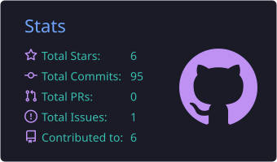
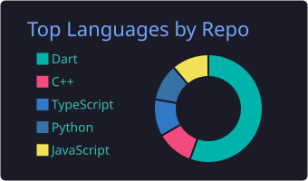
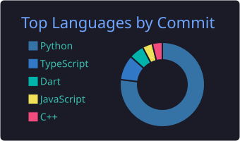
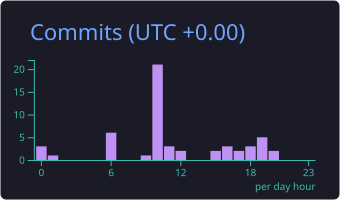

# Hi, I'm Abdelrahman Essam 👋

**Full Stack Software Engineer** with 3 years of experience owning production systems end to end, building with **Flutter**, **React / Next.js**, **Python (Flask / Django / FastAPI)**, **ASP.NET Core** and **Node.js**, plus LLM/RAG integration.

🚀 **Currently:** Full Stack Software Engineer at **[Gift of the Givers](https://giftofthegivers.org/)**: sole engineer behind MOFS, the internal platform used by **500+ employees in 3 countries** to manage **3,000+ humanitarian cases from 7 countries**.

📁 **Portfolio:** [portfolio-omega-one-ao8j6gmdc9.vercel.app](https://portfolio-omega-one-ao8j6gmdc9.vercel.app/)

---

## ⚡ Highlights

- Cut the MOFS cases API from **10+ s to under 500 ms (20x faster)** with indexes, pagination and Redis caching.
- Built GitHub Actions CI/CD that cut deploys from **30 min to 5 min**, shipping staging and production together.
- Built most of a **177-endpoint ASP.NET Core API** and all 51 React pages for [Al-Khimyai](https://khimyai.tech/), used by **1,152+ students**.
- Shipped **14 merged PRs** to [Skipee Sites](https://sites.skipee.co.uk) (UK) and a Playwright pipeline that helped win **3 new clients**.
- Built [Champions Challenge](https://drive.google.com/drive/folders/1nMlgrhIXTZTTTy82klSm_Xf3Cqu2EZwH?usp=sharing), a Flutter trivia game with **10K+ downloads**.

---

## 🌐 Socials

---

## 💻 Tech Stack

**Languages**  

**Frontend & Mobile**  

**Backend**  

**Databases**  

**DevOps & Testing**  

**AI & Architecture**  
`LLM Integration (OpenAI · Gemini · Grok)` · `RAG Pipelines` · `Vector Databases` · `Clean Architecture` · `Monorepo (Turborepo)` · `REST & tRPC APIs` · `Payment Gateways` · `RBAC`

---

## 📌 Featured Projects

### 📦 MOFS / Gift of the Givers — Humanitarian Operations Platform
`Flask` `Flutter` `PostgreSQL` `Redis` `GitHub Actions` `Firebase Hosting`
- Sole engineer, owning it end to end; used by 500+ employees in 3 countries for 3,000+ cases from 7 countries.
- 19-module Flask API (~400 endpoints) + Flutter web app: cases, finance, HR, donors, reports, RBAC.
- Cases API 10+ s → under 500 ms (20x); deploys 30 min → 5 min; hosting costs cut 70%.
- [giftofthegivers.org](https://giftofthegivers.org/)

### 🧪 [Al-Khimyai](https://khimyai.tech/) — Chemistry E-Learning Platform *(1,152+ students)*
`C#` `ASP.NET Core` `EF Core` `SQL Server` `SignalR` `React 19` `TypeScript` `Paymob`
- Live platform for a leading chemistry teacher, with an admin dashboard for the teacher and assistants.
- Built all 51 React pages and most of the 177-endpoint API: streamed video, exams, subscriptions, Paymob/InstaPay/wallet payments, and a real-time forum.

### 🌐 [Skipee Sites](https://sites.skipee.co.uk) — Website Builder & CMS (UK)
`Next.js` `TypeScript` `Supabase` `Stripe` `Playwright`
- 14 merged PRs fixing SEO, speed and payment issues on a live product.
- Playwright pipeline that scrapes a prospect's outdated site and rebuilds it from CMS section variants, helping win 3 new clients.

### 🏥 [Patient Referral Intake & AI Triage](https://github.com/Abdelrahmanessam1254/clinic-referral)
`Next.js` `tRPC` `Drizzle` `PostgreSQL` `Zod` `OpenAI / Gemini / Grok` `Turborepo` `Vitest`
- AI scores patient data and returns severity, urgency, red flags, next steps and a report.
- Clinic chooses its LLM provider and plugs in its own API key; one Zod schema shared end to end.

### ⚽ Champions Challenge — Football Trivia *(10K+ downloads)*
`Flutter` `Firebase` `PostgreSQL`
- 8 minigames with high fan engagement.  
- [Demo](https://drive.google.com/drive/folders/1nMlgrhIXTZTTTy82klSm_Xf3Cqu2EZwH?usp=sharing)

### 🛍 [Koshtna](https://koshtna.cloud/) — Multi-branch Bakery E-commerce *(v2 in progress)*
`Flutter` `Laravel` `Filament` `PostgreSQL` `Redis` `Plutu` `Docker`
- Mobile apps, Filament admin, per-branch inventory, delivery tracking, multi-role access, Arabic-first localization, and online payments.
- [Store](https://koshtna.cloud/) · [Admin](https://admin.koshtna.cloud/) · [Demo](https://drive.google.com/drive/folders/1MdhLwZKuciOyTpQnt9CrDdKOt5a64B_M?usp=sharing)

### 🏆 Troviny — Trip Planner *(#2 Graduation Project)*
`Flutter` `Django` `PostgreSQL` `Firebase` `Railway` `SendGrid`
- Trip planning, personalized recommendations, and community features.  
- [Demo](https://drive.google.com/drive/folders/1OxEwmeXsUpIcpUMCVPk2B8GJReEFD4wW?usp=sharing)

### 🧠 [Clinical QA Engine](https://github.com/Abdelrahmanessam1254/Clinical-QA-Engine)
`Python` `FastAPI` `OpenAI` `Gemini` `Grok`
- LLM API that scores clinical notes and returns severity-tagged actionable feedback.

---

## 📊 GitHub Stats

<!-- SVGs are stored in this repo (./assets) so GitHub Camo won't break external hosts -->

  
  

  
  

  
  

  

---

## 🔗 Highlighted Public Repos

| Repo | Description |
|------|-------------|
| [clinic-referral](https://github.com/Abdelrahmanessam1254/clinic-referral) | Patient referral intake & AI triage (Next.js + tRPC + Drizzle) |
| [Clinical-QA-Engine](https://github.com/Abdelrahmanessam1254/Clinical-QA-Engine) | LLM clinical-note QA API (FastAPI) |
| [Lagovia-Train-Tracker](https://github.com/Abdelrahmanessam1254/Lagovia-Train-Tracker) | Belgian train delay tracker |

---

  

